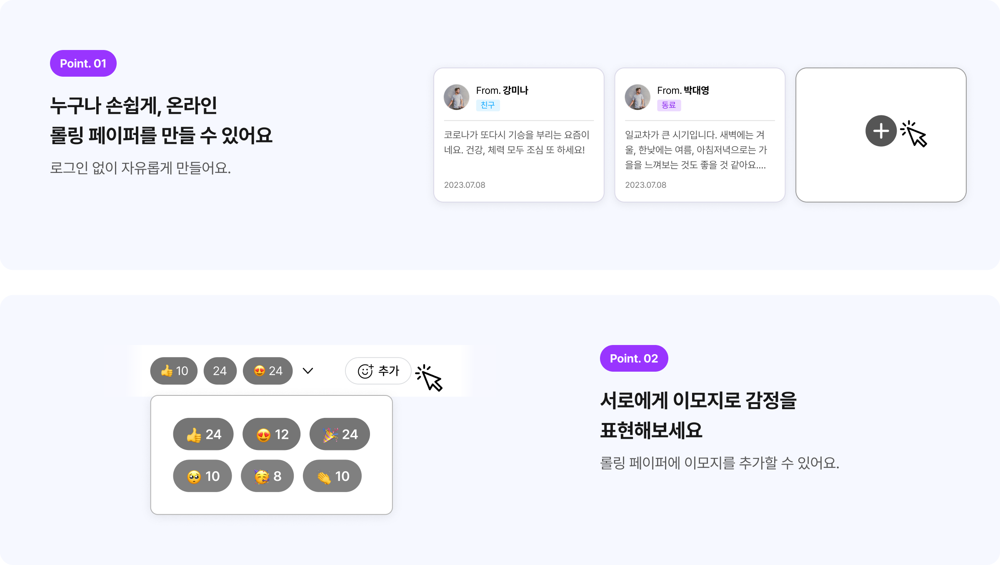

<h1 align="center">
 
</h1>
Rolling(롤링)은 추억의 롤링페이퍼를 웹 상에서도 즐길 수 있는 서비스입니다.   
 
 

- 배포 URL: https://rolling-and-rolling.vercel.app/
- 개발 기간: 2023. 12. 9. ~ 2023. 12. 22. (5인 팀 프로젝트)
   
   

 

## 기술 스택

React, Styled-Component, Vercel

## 주요 기능

롤링페이퍼 생성, 메세지 작성 및 수정, 슬라이더 보기, 이모지 리액션 추가, 카카오톡 공유

## 멤버

- 박지선 (Frontend)
- 김성연 (Frontend)
- 문필겸 (Frontend)
- 우준석 (Frontend)
- 정현진 (Frontend)
